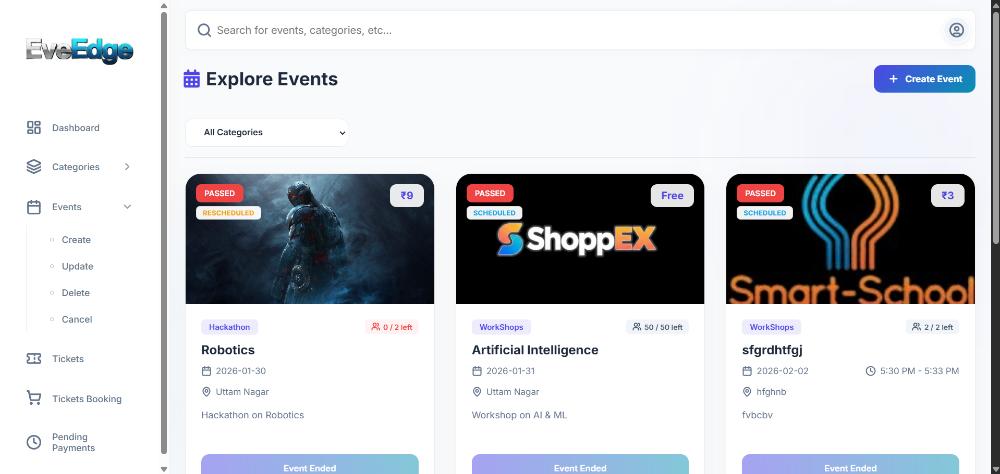
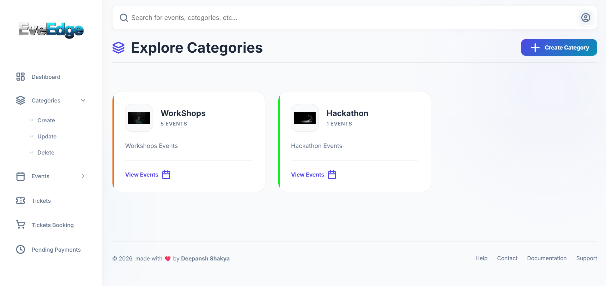
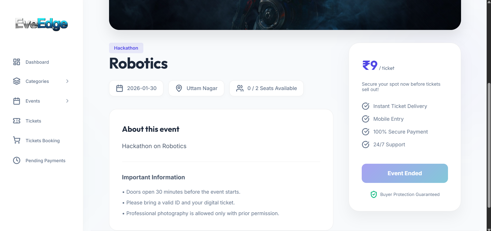
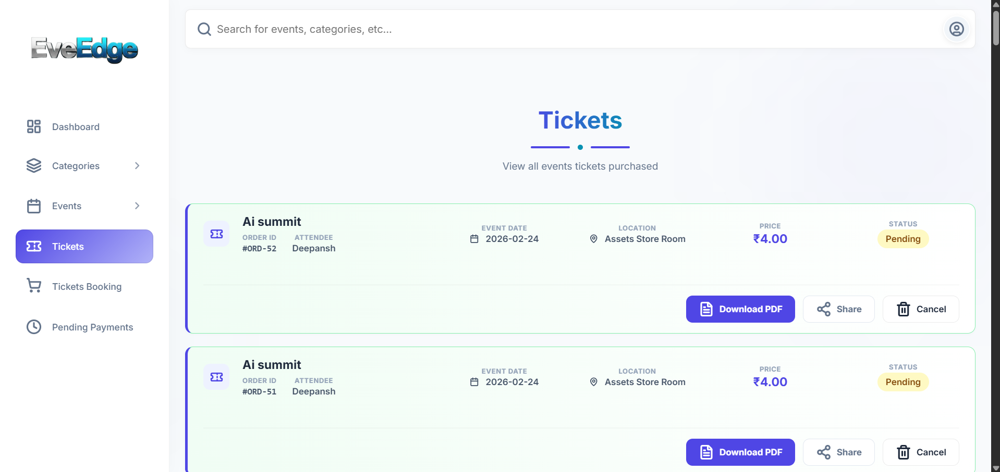
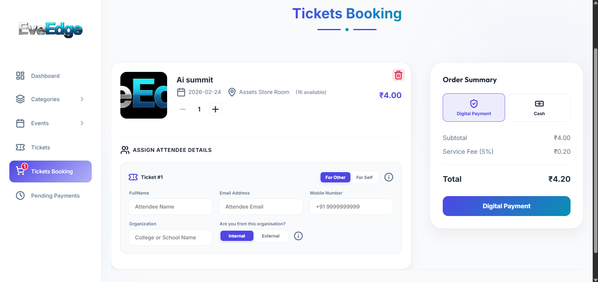

# 🎫 EveEdge - Advanced Event Management System

<div align="center">
  
  <p align="center">
    <strong>A comprehensive, premium solution for managing events, bookings, and ticket generation.</strong>
  </p>

  [](https://spring.io/projects/spring-boot)
  [](https://www.oracle.com/java/)
  [](https://www.mysql.com/)
</div>

---

## 🌟 Overview

**EveEdge** is a robust Event Management Module designed for **Study Explora**. It provides a seamless experience for both administrators and users, handling everything from event creation and category management to ticket booking and secure payments. 

Built with a focus on modern web standards and high-performance backend logic, EveEdge ensures that managing events is as smooth as attending them.

---

## 🚀 Key Features

### 👤 User Management
- **Secure Authentication**: JWT-based authentication for both users and admins.
- **Role-Based Access**: Specialized dashboards for Admins and standard Users.
- **Profile Customization**: Users can manage their personal information and view booking history.

### 📅 Event Orchestration
- **Dynamic Event Creation**: Admins can create events with rich descriptions, locations, and dates.
- **Category Hierarchy**: Organize events into manageable categories (e.g., Music, Tech, Sports).
- **Update & Manage**: Full CRUD operations for events and categories with a professional UI.

### 💳 Booking & Payments
- **Smart Cart System**: Add multiple event tickets to a cart before checkout.
- **Razorpay Integration**: Secure online payment gateway integration for seamless transactions.
- **Pending Payments**: Track and resolve incomplete transactions efficiently.

### 🎟️ Ticketing & Validation
- **Automated PDF Generation**: Professional tickets generated using OpenPDF.
- **QR Code Verification**: Unique QR codes for each ticket (via ZXing) for quick check-ins.
- **Support System**: Built-in help, documentation, and support ticket system.

### ✉️ Communications
- **Email Notifications**: Automated booking confirmations and updates via Gmail SMTP.
- **WhatsApp Integration**: Ready-to-enable WhatsApp Business API for instant alerts.

---

## 🛠️ Technology Stack

| Layer | Technology |
|---|---|
| **Backend** | Java 17, Spring Boot 3.4.1 |
| **Security** | Spring Security, JJWT (JSON Web Token) |
| **Persistence** | Spring Data JPA, MySQL |
| **Frontend** | Thymeleaf, Vanilla CSS (Modern UI) |
| **Payments** | Razorpay SDK |
| **Generation** | OpenPDF (PDF), ZXing (QR Codes) |
| **Mail** | Spring Boot Starter Mail (SMTP) |

---

## 📂 Project Structure

```text
EventManagementModule
├── src/main/java          # Core application logic
│   └── in/sfp/main        # Base package
│       ├── controller     # Web & API controllers
│       ├── model          # JPA entities
│       ├── repository     # Data access layer
│       ├── security       # Security & JWT configuration
│       └── service        # Business logic & integrations
├── src/main/resources     # Configuration & UI
│   ├── static             # CSS, JS, and Images
│   ├── templates          # Thymeleaf HTML pages
│   └── application.properties # Main configuration
└── pom.xml                # Maven dependencies
```

---

## ⚙️ Configuration

To run this project locally, update the `src/main/resources/application.properties` file with your credentials:

### Database Setup
```properties
spring.datasource.url=jdbc:mysql://localhost:3306/EventManagementDB
spring.datasource.username=YOUR_USERNAME
spring.datasource.password=YOUR_PASSWORD
```

### Payment & Mail Setup
```properties
# Razorpay
razorpay.key.id=YOUR_RAZORPAY_KEY
razorpay.key.secret=YOUR_RAZORPAY_SECRET

# SMTP
spring.mail.username=YOUR_EMAIL
spring.mail.password=YOUR_APP_PASSWORD
```

---

## 🏃 Getting Started

1. **Clone the Repository**
   ```bash
   git clone https://github.com/Deepansh1822/EventManagementModule.git
   cd EventManagementModule
   ```

2. **Build the Project**
   ```bash
   mvn clean install
   ```

3. **Run the Application**
   ```bash
   mvn spring-boot:run
   ```
   The app will be available at `http://localhost:9090`.

---

## 📸 Screenshots

<div align="center">
  <table>
    <tr>
      <td align="center"><b>Dashboard</b></td>
      <td align="center"><b>Event Selection</b></td>
      <td align="center"><b>Category Selection</b></td>
    </tr>
    <tr>
      <td></td>
      <td></td>
      <td></td>
    </tr>
    <tr>
      <td align="center"><b>Event Details</b></td>
      <td align="center"><b>Tickets Page</b></td>
      <td align="center"><b>Tickets Booking Page</b></td>
    </tr>
    <tr>
      <td></td>
      <td></td>
      <td></td>
    </tr>
  </table>
</div>


---

## 🤝 Contributing

Contributions are what make the open-source community such an amazing place to learn, inspire, and create. Any contributions you make are **greatly appreciated**.

1. Fork the Project
2. Create your Feature Branch (`git checkout -b feature/AmazingFeature`)
3. Commit your Changes (`git commit -m 'Add some AmazingFeature'`)
4. Push to the Branch (`git push origin feature/AmazingFeature`)
5. Open a Pull Request

---

<div align="center">
  Made with ❤️ by <a href="https://github.com/Deepansh1822">Deepansh</a>
</div>

